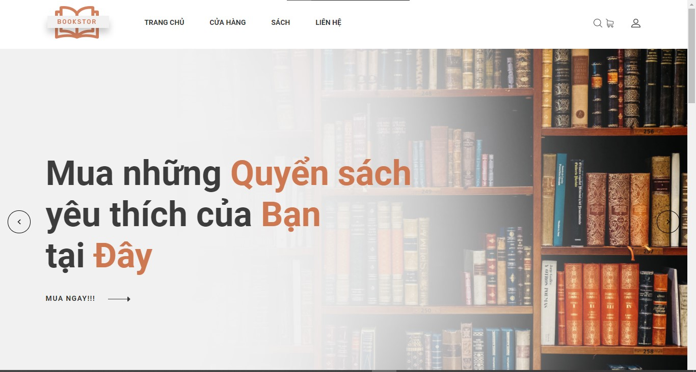
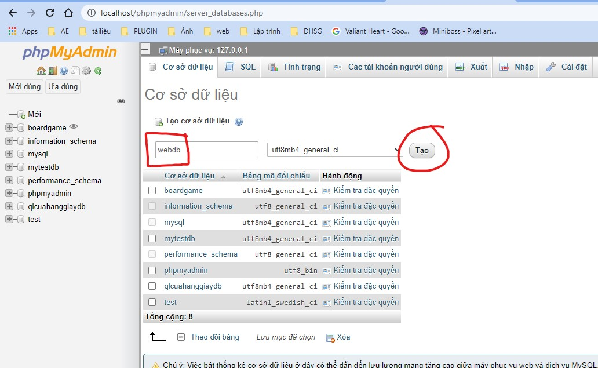
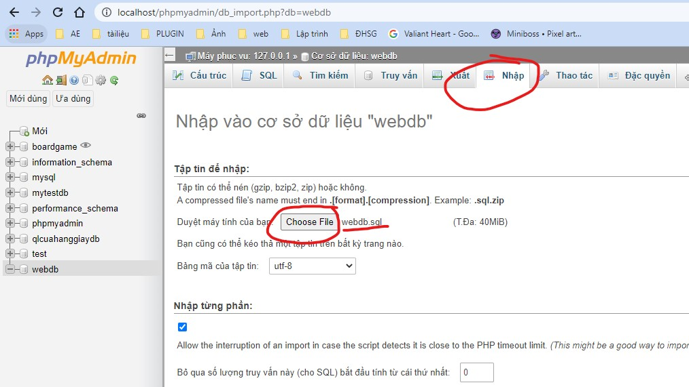
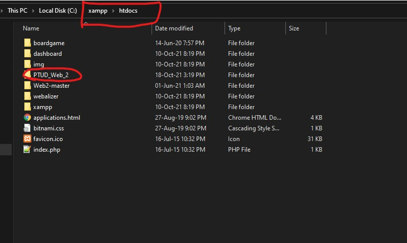

# Webbansach

Xây dụng 1 trang web demo cho việc bán sách.
 
Có kết nối Database bằng Xampp.
 
Được làm Font-end: css, js, boostrap 4.0,... và back end là php.

  
 

# Hướng dẫn cài đặt
Tham khảo cách deploy lên Virtual machine của website này tại file Group12_WebDeployment.pdf

## Database 
Tải xampp cho việc lưu trữ database. 
 
Mở trình duyệt phpAdmin: http://localhost/phpmyadmin
 
Sau đó ta chọn mới, nhập tên là webdb và click ok 

  
 

   Sau đó vào webdb và chọn import/ nhập. Rồi chọn file database.
 

  
 

 
## Nơi cài đặt src
Bỏ source code vào thư mục htdoc

  
 

## Mở trang web
Theo link sau: http://localhost/webbansach/

